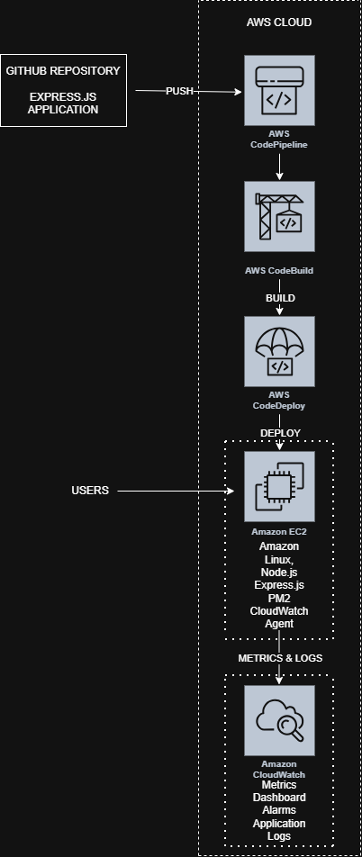

# DevOps Engineer Technical Assignment

## Overview

This project demonstrates the deployment of a production like Express.js application on AWS using DevOps best practices.

### Technologies

- AWS EC2
- IAM
- CodePipeline
- CodeBuild
- CodeDeploy
- CloudWatch
- PM2
- Express.js
- Node.js
- k6

## Architecture

## CI/CD Workflow

GitHub
→ CodePipeline
→ CodeBuild
→ CodeDeploy
→ EC2

## Monitoring

- CloudWatch Dashboard
- CloudWatch Logs
- CloudWatch Alarm

## Load Testing

Load testing was performed using k6.

## Report

The complete implementation report is available in:

[DevOps Assignment Report](report/devops-assignment-report.pdf)

